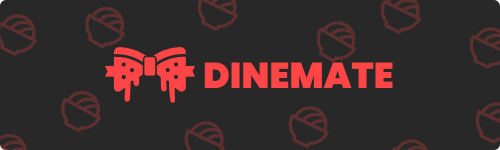

    </img>
 
 

 

    <h1 style="color: #FF4545">DINEMATE</h1>

## Índice 📚

- [Índice 📚](#índice-)
- [Overview 🌎](#overview-)
- [Pré-requisitos ✅](#pré-requisitos-)
- [Instalação 🔧](#instalação-)
- [Licença 📜](#licença-)

<!-- ## Descrição 📝 -->

## Overview 🌎

Este projeto é composto por três partes principais:

- 🧠 API: é o backend do projeto, responsável por fornecer os dados e a lógica de negócio para as outras partes. É construída com Node.js, Express e Postgres.
- 🖥️ Web: é o frontend web do projeto, responsável por fornecer a interface gráfica para os usuários. É construída com React.
- 📱 Mobile: é o frontend móvel do projeto, responsável por fornecer a interface gráfica para os usuários em dispositivos móveis. É construída com React Native e Expo.

Você pode acessar os READMEs específicos de cada parte nos links abaixo:

- [API](https://github.com/EduardoAlvesNeto/dinemate/tree/main/api) 🧠
- [Web](https://github.com/EduardoAlvesNeto/dinemate/tree/main/web) 🖥️
- [Mobile](https://github.com/EduardoAlvesNeto/dinemate/tree/main/mobile) 📱

## Pré-requisitos ✅

Para rodar este projeto, você precisa ter instalado:

- Node.js
- Yarn ou NPM
- Docker

## Instalação 🔧

Para instalar as dependências do projeto, siga os passos abaixo:

1. Clone este repositório em sua máquina local.
2. Navegue até a pasta `api` e execute o comando `yarn install` ou `npm install`.
3. Repita o passo 2 para as pastas `web` e `mobile`.

## Licença 📜

Este projeto está licenciado sob a licença [MIT](https://opensource.org/license/mit/). Consulte o arquivo [LICENSE](LICENSE) para obter mais informações.